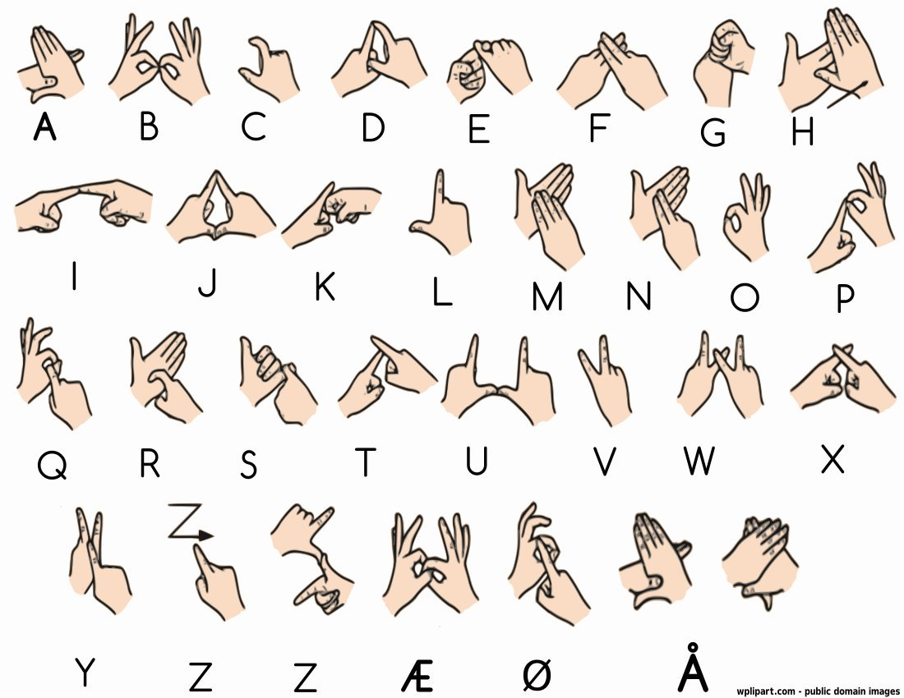

# Gestura

A Python application that enables typing through sign language alphabet recognition using a webcam. Developed as a Machine Vision course project exploring image manipulation, feature detection, segmentation, and deep learning.

## Project Overview

This project replaces traditional keyboard input with webcam-based sign language recognition, providing an alternative text input interface for computer interaction.

**Core Features:**
- Real-time hand detection using computer vision
- Norwegian Sign language alphabet (A-Z) recognition
- Simulated keyboard input to any focused text field

## Usage

### Prerequisites
**System Requirements:**
 
- Python 3.8 or higher ([Download Python](https://www.python.org/downloads/))
- Webcam (built-in or external)

**Install Required Packages:**
- opencv 4.5+
- numpy 1.19+
- pynput 1.7+
```bash
pip install -r requirements.txt
```

### Running the Application

```bash
python gestura.py
```

### Using the Application
Simply click any text field and hold your hand up to the webcam. Sign letters one at a time using the Norwegian Sign Language alphabet shown below. The system will recognize each gesture and type the corresponding character.

## Norwegian Sign Language Alphabet
